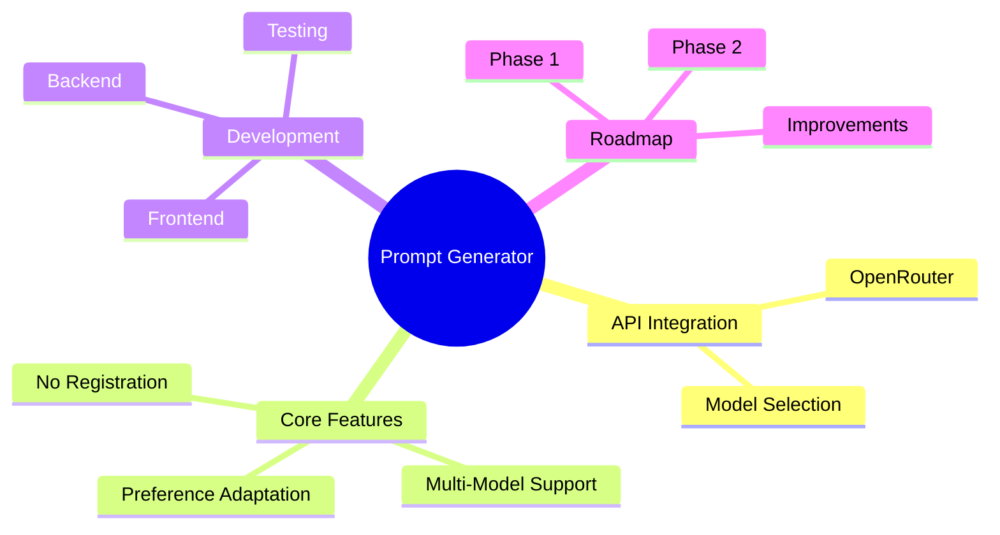

# Master Project Plan

## Project Overview
A prompt generator tool that integrates with OpenRouter API to provide AI model-optimized prompts without requiring user registration.

## Core Features
- [ ] OpenRouter API integration
- [ ] Multi-model prompt optimization
- [ ] No-registration access
- [ ] User preference adaptation

## Supported Models
```json
[
  "allenai/molmo-7b-d:free",
  "bytedance-research/ui-tars-72b:free",
  "cognitivecomputations/dolphin3.0-mistral-24b:free",
  "cognitivecomputations/dolphin3.0-r1-mistral-24b:free",
  "deepseek/deepseek-chat-v3-0324:free",
  "deepseek/deepseek-chat:free",
  "deepseek/deepseek-r1-distill-llama-70b:free",
  "deepseek/deepseek-r1-distill-qwen-14b:free",
  "deepseek/deepseek-r1-distill-qwen-32b:free",
  "deepseek/deepseek-r1-zero:free",
  "deepseek/deepseek-r1:free",
  "deepseek/deepseek-v3-base:free",
  "featherless/qwerky-72b:free",
  "google/gemini-2.0-flash-exp:free",
  "google/gemini-2.0-flash-thinking-exp-1219:free",
  "google/gemini-2.0-flash-thinking-exp:free",
  "google/gemini-2.5-pro-exp-03-25:free",
  "google/gemma-2-9b-it:free",
  "google/gemma-3-12b-it:free",
  "google/gemma-3-1b-it:free",
  "google/gemma-3-27b-it:free",
  "google/gemma-3-4b-it:free"
]
```

## Mindmap Structure


## Checklist
### API Integration
- [ ] Implement OpenRouter connection
- [ ] Handle model-specific prompt formatting
- [ ] Create fallback mechanisms

### User Experience
- [ ] Design intuitive interface
- [ ] Implement model preference system
- [ ] Ensure accessibility

### Development
- [ ] Backend API routes
- [ ] Frontend components
- [ ] Testing framework

## Improvement Tracking
| Date       | Area          | Change Description | Status |
|------------|---------------|--------------------|--------|
|            |               |                    |        |

## Notes
Preferred models for initial focus:
- Gemini 2.0 Flash
- DeepSeek V3
- Gemini 2.5 experimental
- DeepSeek V3.0324